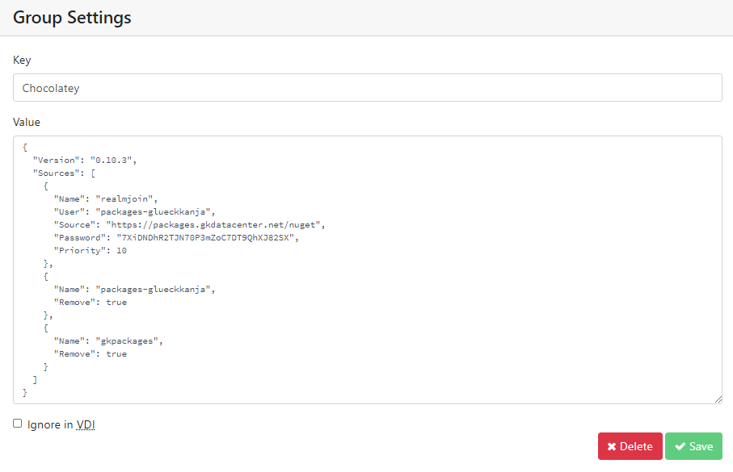

# Groups and Group Settings

### Groups


The Group menu gives you an overview on all tenant registered user groups. RealmJoin synchronizes groups from Azure Active Directory into the RealmJoin back-end.

Since not all users in Azure AD might be equipped with RealmJoin, only a specified range of groups are transferred into RealmJoin \(depending on the group name\). The groups can not be added or altered within RealmJoin, therefore the group naming conventions have to be established in advance.

Six different attributes are displayed in the Group menu:

* **Name** of the group
* A group **Description**
* Group **ID**
* Registered users in a group \(**Us**\)
* The number of installed packages \(**Pa**\)
* The sum of the settings \(**Se**\)


Above the attributes, there is a search bar \(**Search for ...**\). This search compares the input made with each of the attributes and returns suitable results. At the lower right end of the menu, you have the possibility to browse through the pages manually.

If you click on a number in the **Us, Pa** or **Se** field, you will get an overview of the users of a group, the corresponding software packages, and the configured settings.

#### Naming Convention

While there are no strict naming pattern requirements in RealmJoin, we recommend the following convention:

```text
*APP|CFG - Location-Core|Vendor-Product-[Language-][Type-][Flavor]*
```

Examples:

```text
CFG - Global-Core  
CFG - DE-Core  
CFG - DE7499-Core  
APP - Adobe-Photoshop  
APP - Microsoft-Visio  
APP - Mozilla-Firefox  
APP - Mozilla-Firefox-PreRelease  
APP - Mozilla-Firefox-Optional  
APP - Mozilla-Firefox-Optional-PreRelease  
APP - Mozilla-Firefox-x86  
APP - Mozilla-Firefox-x64  
APP - Mozilla-Firefox-DE7499  
APP - Mozilla-Firefox-withFlash
```

The standard synchronization time is 20 minutes \(hh:00, hh:20, hh:40 and all groups that start with **APP -** or **CFG -** are taking into consideration.

The synchronization time is scheduled and the prefixes that are taken into account can be adjusted, currently only if requested. Groups will not be deleted from the RealmJoin back-end if they are removed in Azure/Intune.


The RealmJoin - All Users group is automatically created, which contains all users with a RealmJoin installation on at least one of their clients.


### Group Settings


The mentioned settings, which are configured for the groups, can be checked and edited in the Group Settings menu.


The listed settings are based on the JSON file format. JSON is described in our [JSON - Short Overview article](../packages/json-backgrounder.md). Username shows you which user has which setting. If a setting is listed several times, this means that it is set for several users.

Just click on a Key to edit it. An input mask opens:



In this mask you can enter a **Key** and a **Value**. Additionally, below the value field, you can enable or disable 'Ignore in VDI'. If you enable it, a group setting cannot be executed during a 'Virtual Desktop Infrastructure' \(VDI\) session.

Once your editing is complete, click **Save** to apply your changes. If you want to delete this setting, click **Delete**.

